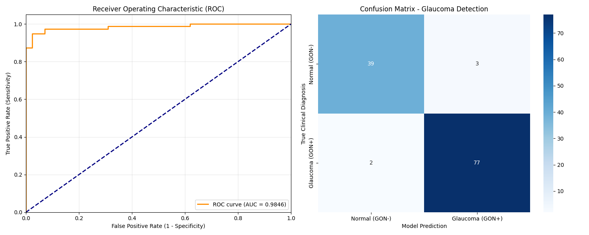

# 👁️ Glaucoma Detection AI: Datathon 2026

An AI-powered diagnostic tool designed to assist ophthalmologists in identifying Glaucoma from retinal fundus images. This project utilizes **MobileNetV2** for feature extraction and **Grad-CAM** for explainable AI (XAI), highlighting the specific regions of the eye influencing the model's decision.

## 📊 Project Overview
Glaucoma is a leading cause of irreversible blindness. Early detection is critical, but manual screening is time-consuming and prone to human error. This tool provides:
* **High-Precision Classification:** Differentiates between Normal (GON-) and Glaucoma (GON+) scans.
* **Visual Explanations:** Generates heatmaps to show where the AI is "looking" (e.g., the optic disc).
* **Real-time Interface:** A Streamlit-based web app for instant diagnostic reporting.

## 📁 Repository Structure
```text
├── app.py                # Streamlit Web Interface (Main Entry Point)
├── glaucoma.py           # Data Preprocessing & Model Training Script
├── evaluate.py           # Detailed Model Evaluation (ROC & Confusion Matrix)
├── Labels.csv            # Clinical Dataset Labels (Image Name vs Diagnosis)
├── Images/               # Raw Fundus Images (700+ JPG/PNG files)
└── results/              # Folder for model artifacts and outputs
    └── model_performance_summary.png  # Generated ROC & Confusion Matrix Plot
```

## 🚀 How to Run
### 1. Requirements
Ensure you have Python installed, then install the dependencies:
```bash
pip install streamlit tensorflow opencv-python pillow pandas scikit-learn seaborn matplotlib
```

### 2. Prepare Data
* Place your raw images in an `Images/` folder in the root directory.
* The `Labels.csv` should be in the root directory.
* Run `python glaucoma.py` to preprocess images and train the model.

### 3. Launch the App
```bash
streamlit run app.py
```

## 📈 Model Performance
The model is evaluated based on its ability to minimize False Negatives (critical in medical diagnostics).

* **Architecture:** MobileNetV2 (Transfer Learning)
* **Input Size:** 224x224 RGB
* **Metrics:** View the performance summary below:




## 🧠 Explainable AI (Grad-CAM)
We use Gradient-weighted Class Activation Mapping (Grad-CAM) to ensure clinical transparency. By visualizing the "Focus Map," doctors can verify if the AI is focusing on the optic nerve head rather than irrelevant background artifacts.
